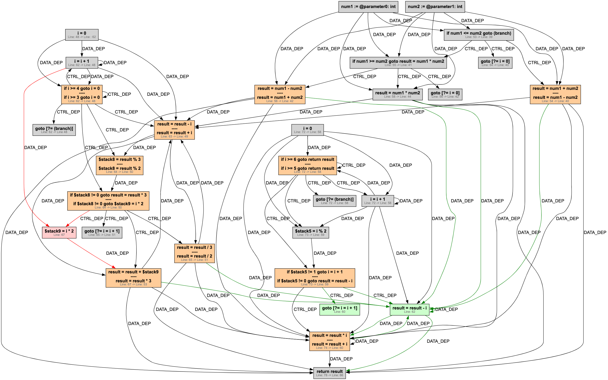

## Graph Based Code differencing

_Objectives of this repository: Create a novel graph-based differencing approach, with the aim of improving code-differencing with respects to semantics, with some corresonding tool that software engineers can use._

This application is designed to take two Java classes, and produce a graph-based representation of the differences between them. This can then be visualised in a traditional text-bsed format, or as a graph.
It represents both classes as a [Program Dependence Graph](https://dl.acm.org/doi/10.1145/24039.24041) (generated through [Soot](https://github.com/soot-oss/soot)) and uses heuristics to perform graph isomorphism.
The application will suggest which methods might have originated from one another and will suggest edit scripts between methods in the source and destination file. The final output will be a singular `diff.json` which represents the aggregated per-method edit scripts.

Due to the fact that a PDG is often built from an intermediate representation for the sake of proper analysis, such as LLVM for a C/C++ program or Java Bytecode in this case, some syntactic differences won't be captured, and the algorithm will be limited to the granularity of the intermediate representation. For the purpose of a closer and more accurate
differencing, compiler optimisations are disabled for target comparison files both at the java compiler level and the Soot level. In construction of Jimple, Soot's IR, some optimisations are not configurable and this is a described limitation of the approach.
In some specific use cases, such as analysis efficiencies or trying to determine if programs are semantically identical, this tool should (🤞) be more useful than other differencing approaches.

If you find this interesting, please feel free to read the thesis (link wip) I wrote in conjunction with this tool!

### How does this work?


The complete process flow is described in the above visualisation. Data is read in from the source and destination files, and a PDG is generated for each. The PDGs are then compared using a graph isomorphism strategy, and the results are used to generate an pairing between methods. Each method pairing also has a node mapping, which is used to generate a edit script between two methods. A recovery method is applied to this to analyse operations using further heuristics, and these edit scripts are aggregated to create a final delta that summarises the changes between two files. 
Current recommended matching strategies, that are proven to work quite well in most cases include VF2 and GED.

### How can I visualise the changes?

After running the program with the preffered matching engine settings, the diff can be visualised in different ways. Most commonly, 
one can run the _py-visualise_ Flask app to view the diff in its side-by-side, text-based form. Alternatively, remaning more loyal to the graph-based differencing approach, the delta can be viewed at the Jimple level as a singular _delta_
graph. This can be used by exporting the dot file created in the delta-graph folder to a png, or similar.


**NB**: This delta has been edited slightly to ensure its readable on this README and not too large. This delta graph depicts the changes that transform the method _detailedComputation_ to the method _complexCalculation_, both depicted at the Java level in the text-based visualisation below.

Alternatively, the delta can be visualised with a more traditional side-by-side view, as shown below. Note that because differencing occurs at the IR level post compiler-optimisation, some syntactic differences may not be captured. As an example, deadcode in addNumbers is not considered. This view can be run by `cd`'ing to the `py-visualise` directory and running `python3 app.py` following a install of the required dependencies.


Insertions and Deletions are marked with a green and red background respectively. Update operations are marked with a variety of colours, so that changes across the source and destination methods and the node pairings of the algorithm can be easily identified. A list of all the edit operations required to describe the delta is listed below the visualisation.

### List of dependencies
 - Java 8 (an older version of Java is required to use Soot)
 - Maven 3.6.x
 - Soot 4.3.0
 - Python 3.8.x or later

### Getting Started
To run,

Compile dependencies;
```bash
mvn compile
```

Run the application;
```bash
mvn exec:java -Dexec.mainClass="org.pdgdiff.Main"
```

Run the application with arguments for differencing;

This implementation of the approach (that is, using Soot) requires the following arguments:
- The relative path to the source and destination versions files.
- The relative path to the compiled source and destination versions files.
- The fully qualified name of the class in the source and destination files.
```bash
mvn exec:java -Dexec.mainClass="org.pdgdiff.Main" -Dexec.args="<beforeSourcePath> <afterSourcePath> <beforeCompiledDir> <afterCompiledDir> <beforeClassName> <afterClassName>"
```

Package the application (necessary for evaluation purposes only);
```bash
mvn clean package
```

To run the Flask frontend for text-based visualisation;
```bash
cd py-visualise
python3 app.py
```